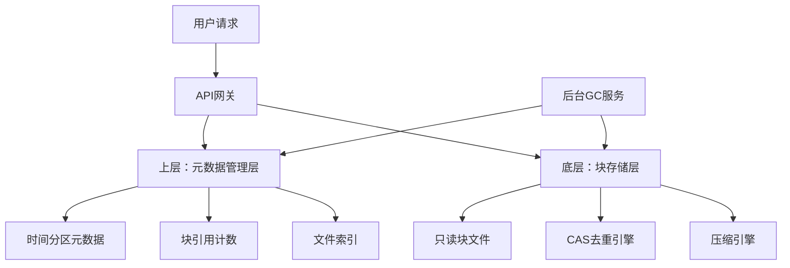
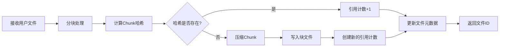
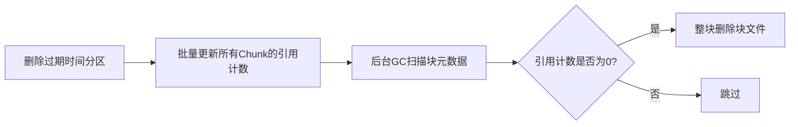

# 小文件存储系统开发设计文档

## 文档信息

|项|说明|
|---|---|
|版本|v1.0|
|日期|2026-04-17|
|状态|开发就绪|
|目标|解决 FastDFS 小文件去重与生命周期管理的矛盾，实现高性能、低维护成本的轻量小文件存储|
---

项目名：JiHuan
中文名：集焕

## 1. 项目背景

### 1.1 现有系统痛点

公司现有 FastDFS 存储系统，在海量小文件 + 全局去重的场景下，存在以下核心痛点：

1. **块内空洞问题**：全局去重导致同一块内的文件生命周期差异极大，无法按时间整块清理，按文件删除后块内产生大量空洞，空间利用率低至 60%

2. **IO 性能问题**：随机删除小文件导致大量随机 IO，块文件碎片化严重，读写性能下降 50% 以上

3. **维护成本高**：原有 C 实现的清理策略复杂，去重与清理的矛盾无法从根本上解决，维护成本极高

4. **inode 耗尽风险**：海量小文件导致 inode 快速耗尽，磁盘明明还有空间却无法写入

### 1.2 设计目标

1. **彻底解耦去重与生命周期**：解决两者的核心矛盾，实现零空洞、零写放大的存储

2. **高性能**：顺序写、并行读，性能远超 FastDFS

3. **可配置**：全参数可配置，适配不同业务场景

4. **低维护成本**：纯 Rust 实现，易维护、易扩展

5. **生产级稳定**：支持崩溃恢复、数据校验、错误重试

---

## 2. 核心架构

我们采用**两层分离架构**，彻底解耦去重与生命周期管理，这是工业界验证过的最优方案：


|分层|核心职责|核心能力|
|---|---|---|
|**元数据管理层**|生命周期管理、文件索引、引用计数|按时间分区批量管理，彻底解决生命周期问题|
|**块存储层**|CAS 内容定址、全局去重、块数据存储|只读块文件，全局去重，彻底解决去重问题|
---

## 3. 核心模块设计

### 3.1 分块模块

#### 职责

将用户文件拆分为固定大小的 Chunk，小文件自动聚合，大文件自动拆分，为去重做准备。

#### 配置项

|配置项|默认值|说明|
|---|---|---|
|`chunk_size`|4MB|分块粒度，可配置 2MB/4MB/8MB|
#### 处理逻辑

1. 读取用户文件，按`chunk_size`拆分

2. 小文件（小于`chunk_size`）直接作为一个 Chunk

3. 大文件拆分为多个 Chunk，最后一个 Chunk 不足则补全

4. 每个 Chunk 生成独立的哈希，用于去重

### 3.2 块存储模块

#### 职责

将多个 Chunk 聚合为大的只读块文件，实现整块删除、无空洞存储。

#### 配置项

|配置项|默认值|说明|
|---|---|---|
|`block_file_size`|1GB|块文件最大大小，可配置 512MB/1GB/2GB|
#### 块文件格式

```Plain Text

+----------------+----------------+----------------+----------------+
| Block Header   | Chunk 1 Data   | Chunk 2 Data   | ...            |
+----------------+----------------+----------------+----------------+
| Chunk 1 Meta   | Chunk 2 Meta   | ...            | Footer         |
+----------------+----------------+----------------+----------------+
```

- **Block Header**：块 ID、创建时间、Chunk 数量、校验和

- **Chunk Data**：Chunk 的压缩后数据，顺序存储

- **Chunk Meta**：每个 Chunk 的偏移、原始大小、压缩后大小、哈希

- **Footer**：块的结束标记，用于崩溃恢复

#### 特性

1. **只读**：块文件一旦写入，永远不会修改，只有整块删除

2. **顺序写**：所有写入都是顺序写，性能拉满

3. **整块删除**：删除时直接删除整个块文件，无空洞、无随机 IO

### 3.3 元数据模块

#### 职责

管理文件元数据、块引用计数、时间分区，用 redb 嵌入式 KV 存储，支持事务。

#### 核心数据结构

```rust

// 文件元数据
struct FileMeta {
    file_id: String,          // 文件ID
    file_name: String,        // 文件名
    file_size: u64,           // 文件大小
    create_time: u64,         // 创建时间
    partition_id: String,     // 所属时间分区
    chunks: Vec<ChunkMeta>,   // Chunk列表
}

// Chunk元数据
struct ChunkMeta {
    block_id: String,         // 所属块ID
    offset: u64,              // 在块内的偏移
    original_size: u64,       // 原始大小
    compressed_size: u64,     // 压缩后大小
    hash: String,             // 内容哈希
}

// 块元数据
struct BlockMeta {
    block_id: String,         // 块ID
    ref_count: u64,           // 引用计数
    create_time: u64,         // 创建时间
    path: String,              // 块文件路径
}
```

#### 时间分区

将元数据按时间分区，比如 24 小时一个分区，删除过期数据时，直接删除整个分区的元数据，批量处理，性能极高。

### 3.4 去重模块

#### 职责

基于内容哈希的全局去重，相同内容的 Chunk 只存储一份。

也可以配置不去重

#### 配置项

|配置项|默认值|说明|
|---|---|---|
|`hash_algorithm`|`sha256`|哈希算法，可选`md5`/`sha1`/`sha256`/`none`|
#### 处理逻辑

1. 对每个 Chunk 计算内容哈希

2. 检查哈希是否已经存在

3. 如果存在：直接复用已有的 Chunk，引用计数 + 1

4. 如果不存在：写入新的 Chunk，创建新的引用计数

### 3.5 压缩模块

#### 职责

对块内的 Chunk 进行压缩，节省磁盘空间。

#### 配置项

|配置项|默认值|说明|
|---|---|---|
|`compression_algorithm`|`zstd`|压缩算法，可选`none`/`lz4`/`zstd`|
|`compression_level`|1|压缩级别，1-22，越高压缩比越大|
#### 特性

1. 每个 Chunk 独立压缩，支持随机读取

2. 支持 SIMD 加速，压缩速度远超磁盘速度

3. 可配置，适配不同场景

### 3.6 生命周期与 GC 模块

#### 职责

管理数据的生命周期，后台异步回收无引用的块文件。

#### 配置项

|配置项|默认值|说明|
|---|---|---|
|`time_partition_hours`|24|时间分区粒度，可选 6/12/24/72|
|`gc_threshold`|0.7|磁盘使用率达到该值，自动触发 GC|
#### 清理流程

1. **删除文件**：删除文件的元数据，对应 Chunk 的引用计数 - 1

2. **批量删除分区**：过期的时间分区，直接删除整个分区的所有元数据，批量更新引用计数

3. **后台 GC**：定期扫描块元数据，找到引用计数为 0 的块，直接整块删除块文件

---

## 4. 核心流程

### 4.1 写入流程


### 4.2 读取流程


### 4.3 清理流程


---

## 5. 可配置系统

所有参数都支持配置文件 / 启动参数动态调整，以下是不同场景的配置模板：

### 5.1 默认通用配置（推荐）

```toml

# 通用场景，平衡安全、速度、空间，适合大部分业务
block_file_size = "1GB"
chunk_size = "4MB"
hash_algorithm = "sha256"
compression_algorithm = "zstd"
compression_level = 1
time_partition_hours = 24
gc_threshold = 0.7
```

### 5.2 极致速度场景

```toml

# 热点数据、低延迟场景，不在意空间
block_file_size = "512MB"
chunk_size = "8MB"
hash_algorithm = "md5" # 内部私有系统可用
compression_algorithm = "none" # 关闭压缩
compression_level = 0
time_partition_hours = 12
gc_threshold = 0.8
```

### 5.3 极致空间场景

```toml

# 冷数据归档，追求最大空间利用率
block_file_size = "2GB"
chunk_size = "4MB"
hash_algorithm = "sha256"
compression_algorithm = "zstd"
compression_level = 9 # 高压缩比
time_partition_hours = 72
gc_threshold = 0.6
```

### 5.4 海量小文件场景

```toml

# 90%以上为10KB以下小文件，比如图片、文档
block_file_size = "512MB"
chunk_size = "2MB"
hash_algorithm = "sha256"
compression_algorithm = "zstd"
compression_level = 3 # 小文件压缩比更高
time_partition_hours = 24
gc_threshold = 0.7
```

### 5.5 大文件为主场景

```toml

# 90%以上为100MB以上大文件，比如视频、备份
block_file_size = "2GB"
chunk_size = "8MB"
hash_algorithm = "sha256"
compression_algorithm = "zstd"
compression_level = 1
time_partition_hours = 72
gc_threshold = 0.8
```

---

## 6. 技术栈

所有依赖均为 Rust 生态成熟稳定的工业级组件：

|组件|版本要求|职责|
|---|---|---|
|Rust|1.75+|核心开发语言，稳定版无需 nightly|
|redb|最新稳定版|嵌入式事务 KV，元数据存储|
|tokio|1.0+|异步运行时，处理并发请求|
|md-5/sha2|最新稳定版|哈希计算，内置 SIMD 加速|
|lz4/zstd|最新稳定版|压缩算法，内置 SIMD 加速|
|parking_lot|最新稳定版|高性能锁，比标准库快 30%|
|wal-rs|最新稳定版|预写日志，崩溃恢复|
|axum|0.7+|轻量 HTTP 框架，API 网关|
---

## 7. 分阶段实现计划

### 7.1 MVP 阶段（1-2 周）

目标：跑通最小可用版本，验证核心逻辑

1. 基础框架搭建，配置加载

2. 分块模块实现

3. 块存储模块实现，基础的块文件读写

4. 元数据模块实现，redb 基础操作

5. 基础去重模块实现

6. 基础的文件上传 / 下载 / 删除接口

7. 基础的 GC 逻辑

### 7.2 生产级阶段（2-3 周）

目标：达到生产可用，稳定、可靠

1. WAL 预写日志实现，崩溃恢复

2. 数据校验：CRC32+SHA 双重校验

3. 压缩模块实现，可配置压缩算法

4. 完整的后台 GC 服务，异步回收

5. 错误处理与重试机制

6. 运维监控接口，状态查询

7. 压力测试与性能优化

### 7.3 进阶阶段（可选）

目标：扩展高级特性，按需迭代

1. CDC 可变分块，提升大文件去重率

2. 冷块合并，进一步优化空间利用率

3. 分布式扩展，支持多节点集群

4. 缓存层，热点数据缓存

5. 权限管理，多租户支持

---

## 8. 数据安全与一致性

### 8.1 崩溃恢复

1. 所有元数据修改都先写入 WAL 预写日志

2. 系统启动时，重放 WAL 日志，恢复未完成的操作

3. 块文件的 Footer 标记，用于检测未完成的块写入，自动清理

### 8.2 数据校验

1. 每个 Chunk 都有内容哈希，读取时校验，保证数据不损坏

2. 每个块文件都有整体校验和，保证块文件的完整性

3. 写入时先写数据，再更新元数据，保证数据一致性

### 8.3 错误处理

1. IO 错误自动重试，最多 3 次

2. 网络错误自动重试，指数退避

3. 磁盘满时自动触发 GC，清理过期数据

4. 异常块自动标记，避免影响其他数据

---

## 9. 运维与监控

### 9.1 监控指标

|指标|说明|
|---|---|
|磁盘使用率|当前磁盘的使用率，超过阈值自动触发 GC|
|写入 QPS|每秒写入请求数|
|读取 QPS|每秒读取请求数|
|去重率|当前的全局去重率|
|压缩比|当前的压缩比|
|GC 耗时|后台 GC 的耗时|
|块文件数量|当前的块文件数量|
### 9.2 运维接口

|接口|方法|说明|
|---|---|---|
|`/api/status`|GET|查询系统状态，监控指标|
|`/api/gc/trigger`|POST|手动触发 GC|
|`/api/config/reload`|POST|重新加载配置|
|`/api/block/list`|GET|列出所有块文件|
|`/api/file/list`|GET|列出所有文件|
---

## 10. 预期性能指标

|指标|预期值|说明|
|---|---|---|
|顺序写入速度|800MB/s+|单节点，顺序写大文件|
|随机读取速度|600MB/s+|并行读小文件|
|空间利用率|95%+|无空洞，去重 + 压缩后|
|删除性能|10 万文件 / 秒|批量删除时间分区|
|元数据响应时间|<1ms|元数据查询|
|块文件数量|<1000|1TB 磁盘，避免 inode 耗尽|
---

## 11. 风险与应对

|风险|应对方案|
|---|---|
|块文件过大导致冷块合并开销大|可配置块文件大小，小文件场景调小|
|哈希碰撞|默认用 SHA256，碰撞概率几乎为 0；内部场景用 MD5 时，增加二次校验|
|并发写入冲突|用 redb 的事务，保证原子性；块文件的写入锁，避免并发写同一个块|
|内存溢出|分块处理，流式读写，不加载整个文件到内存|
> （注：文档部分内容可能由 AI 生成）